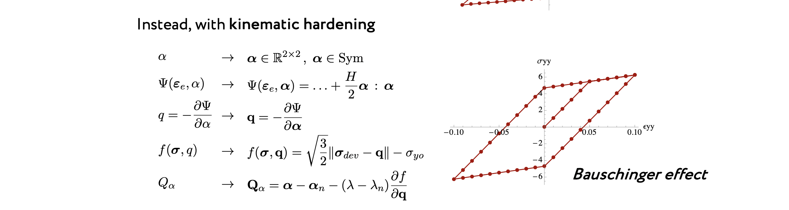
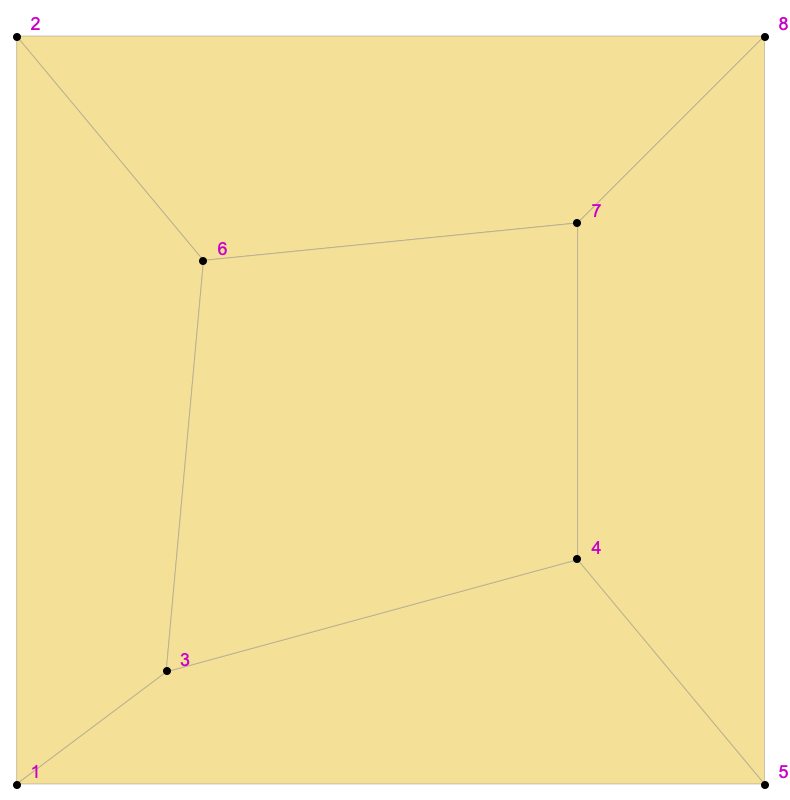

# Cinematic hardening introduction

What I have to do:

 

## Let's try

### Patch test :



### Code 

Aumento `lhg` da 5 a 7 per includere le tre componenti di α. 

Redefinem, need to use definition inside `SMSFreeze`, not external assignment:

```mathematica
SMSFreeze[\[Alpha], {{\[DoubleStruckH]g[[4]], \[DoubleStruckH]g[[
    6]]}, {\[DoubleStruckH]g[[6]], \[DoubleStruckH]g[[5]]}}, 
 "Symmetric" -> True]

 \[Lambda] = \[DoubleStruckH]g[[7]];
```

Energy redefine:

```mathematica
\[CapitalPsi]e \[DoubleRightTee] \[Lambda]e/
    2 (Tr[\[DoubleStruckCapitalD]e])^2 + \[Mu]e Tr[\
\[DoubleStruckCapitalD]e . \[DoubleStruckCapitalD]e] + 
   1/2 H Tr[Transpose[\[Alpha]] . \[Alpha]];
   ```

   Redefine yelding function:

   ```mathematica
  fg \[DoubleRightTee] 
  SMSSqrt[
    3/2 Tr[
      Transpose[\[Sigma]dev - q] . (\[Sigma]dev - q)]] - (\[Sigma]YO);
  ```

  Does vector derivative require special definition ? Like $\mathbf{q}=-\frac{\partial \Psi}{\partial \boldsymbol{\alpha}}$ or $\mathbf{Q}_{\alpha}=\boldsymbol{\alpha}-\boldsymbol{\alpha}_{n}-\left(\lambda-\lambda_{n}\right) \frac{\partial f}{\partial \mathbf{q}}$ ? 

  Also update:

  ```mathematica
  \[Alpha]n = {{\[DoubleStruckH]gnIO[[4]], \[DoubleStruckH]gnIO[[
     5]]}, {\[DoubleStruckH]gnIO[[5]], \[DoubleStruckH]gnIO[[6]]}};
\[Lambda]n = \[DoubleStruckH]gnIO[[7]];
```

Must update also `q` with `symmetric` flag:

```mathematica
SMSFreeze[q, -SMSD[\[CapitalPsi]e, \[Alpha], "Symmetric" -> True], 
  "Symmetric" -> True];
```

Output for the procedure:
```mathematica
\[DoubleStruckCapitalQ] = {\[DoubleStruckCapitalQ]\[Epsilon][[1, 
    1]], \[DoubleStruckCapitalQ]\[Epsilon][[2, 
    2]], \[DoubleStruckCapitalQ]\[Epsilon][[1, 2]], Qq[[1, 1]], 
   Qq[[2, 2]], Qq[[1, 2]], Q\[Lambda]};
   ```

> 22 dec - Update after talk with prof.

## NOW THE CODE WORKS !

See [first_test/EP_ACM_2021 2.nb](EP_ACM_2021%202.nb) notebook
